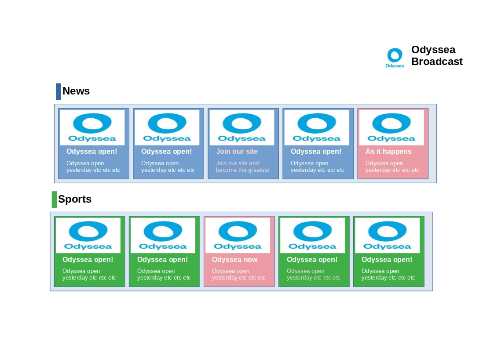

# NewspaperFS20

Our firm got a contract on the well known news channel Odyssea Broadcast. Your team should develop the News front page of the site.
## User requirements:
1. The News front page has 5 sections: News, Intenrational, Opinion, Sport (note 1).
1. Each section should have 5 cards with news. Each card should have an image, a header and a brief.
1. Each section should have a header with the section name (note 2)
1. Some cards are "Live Feeding" cards, ie cards that contains updating feeds (note 3). They should have a redish background (or pick a color that match your palette).
1. Some cards are advertorials (paid articles). The text color of these should be dark red (or pick a color that match your palette).
1. The page should display the *Odyssea Broadcast* name on top right, like a logo
1. The color palette is up to you.
1. See the [mockup](#mockup) 

You should create two versions, looking the same, using different approaches.
### First approach - using tables
Each section should be a table 1x5, without borders

### Second approach - using divs
Each section is a div containg 5 divs

## Notes
* Note 1: see https://www.bbc.com. It has 3 sections: Welcome to BBC.com, News, Sport. News and Sport have 3 cards each.
* Note 2: style the header like the BBC: with a line at the left, different color for each section. See News and Sport headers in BBC.
* Note 3: if you don't know what a live feed is, you may find one at  https://www.theguardian.com

## Proposed steps
You may try your own way or you may review the steps I am proposing below.

### Proposed steps for tables
1. Create the page + the boilerplate code + the css
1. Add images
1. Write the *Odyssea Broadcast* name as header. Style it to be at the right
1. Add header for News section
1. Add a 1x5 table. Make it borderless.
1. (In each cell) Add the image, the header, the brief. Style the text. Style the cell (eg padding)
1. Repeat the 3 steps for the other sections
1. Select 2 cards to be "Live Feeding"
1. Select 3 cards to be Advertorial. One card should be both Advertorial and Live Feeding 

### Proposed steps for divs
These are the same as the steps for tables. The only difference is that isntead of making a 1x5 table, you should make a div and put inside 5 other divs, same size, aligned one next to the other.

## Images
### Mockup
